# PROJETO: SB - Studio de Beleza
## Projeto Final do Curso Técnico em Informática do Colégio Pedro II - Campus Duque de Caxias - 2019

# Integrantes:
- Emanuelle de Araújo Siqueira
- Emerson Marcelo da Silva Teixeira
- Leticia Lopes Corrêa
- Sarah Ferreira Oliveira

# Sumário
- [Proposta](#Visão-Geral-da-Proposta)
- [Requisitos](#Requisitos)
- [Casos de Uso](#Casos-de-Uso)
- [Modelagem](#Modelagem)
- [Manual de Utilização](#Manual-de-Utilização)

## Visão Geral da Proposta
- Construção de Desenvolvimento Web para um Studio de Beleza que auxilie principalmente no agendamento dos serviços oferecidos pelo salão.

[Proposta](https://github.com/cp2-dc-info-projeto-final/sb-studio-de-beleza/blob/master/Documentacao/proposta.md)

## Stakeholder
 Evelyn Cantarino Marins Pereira - Empresária do Studio de Beleza Evelyn Marins

## Requisitos
[Entrevista em texto](https://github.com/cp2-dc-info-projeto-final/sb-studio-de-beleza/blob/master/Documentacao/entrevista.md)

[Entrevista em áudio](https://github.com/cp2-dc-info-projeto-final/sb-studio-de-beleza/blob/master/Documentacao/entrevista.mp3)

[Especificação de Requisitos](https://github.com/cp2-dc-info-projeto-final/sb-studio-de-beleza/blob/master/Documentacao/requisitos.md)

## Casos de Uso
Diagrama de Casos de Uso:
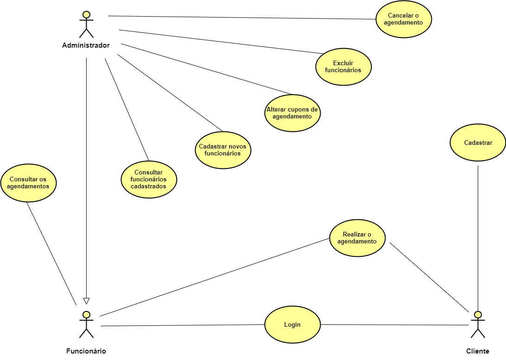

[Especificação de Casos de Uso](https://github.com/cp2-dc-info-projeto-final/sb-studio-de-beleza/blob/master/Documentacao/casos-de-uso.md)

## Modelagem
**Diagrama de Classes**

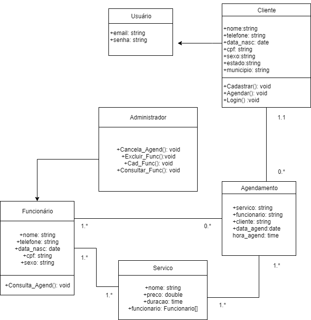

**Diagrama Banco de Dados**

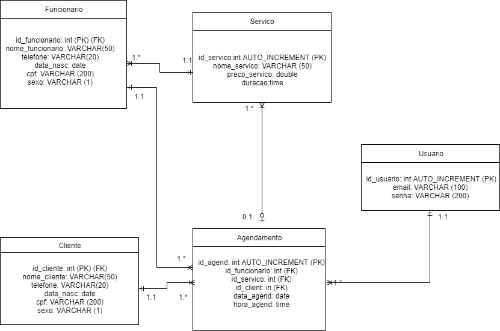

[Script SQL](Projeto/schema.sql) 

## Manual de Utilização
 Ao entrar no site, se for cadastrado, o usuário pode realizar login com email e senha. 
 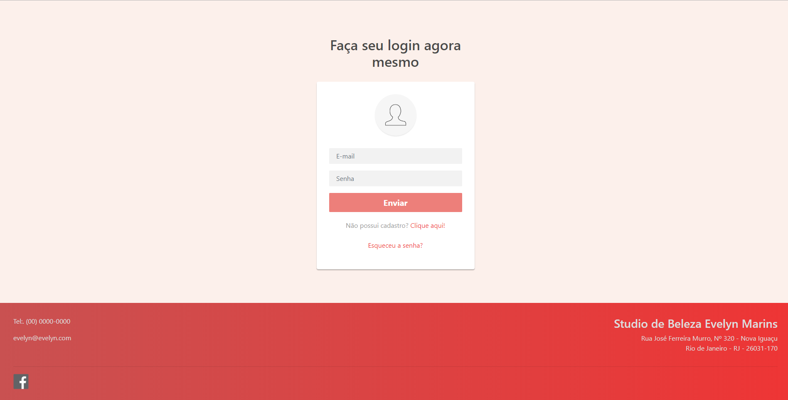

 Caso ainda não seja cadastrado, poderá acessar a página de cadastro através no login. Ao escolher esta opção, o usuário é redirecionado à uma página onde preencherá um formulário com informações pessoais como nome, cpf, sexo, telefone, estado, municipio, email, senha e também uma pergunta de segurança em casos de emergência.  
   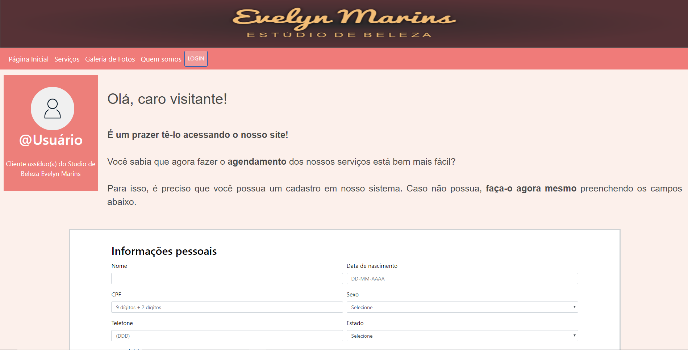
    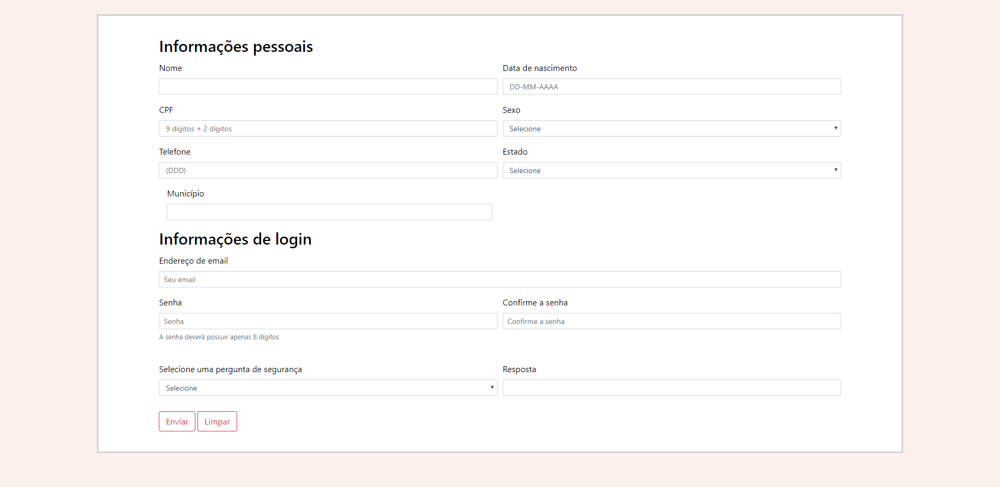
   
   Após finzalizar o cadastro, o usuário é redirecionado para a página inicial, que contem uma breve descrição do studio, fotos, e um menu que pode o levar para as outras páginas do site.
    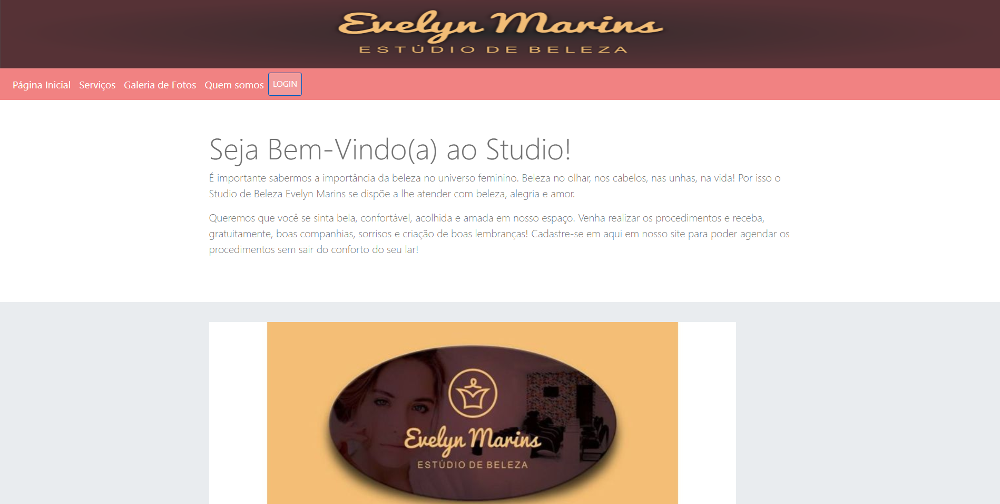
    
   *Todas as páginas contém um menu que o levará para outras páginas, e também um rodapé com as principais informações do studio(Telefone, localização etc.) 
    
   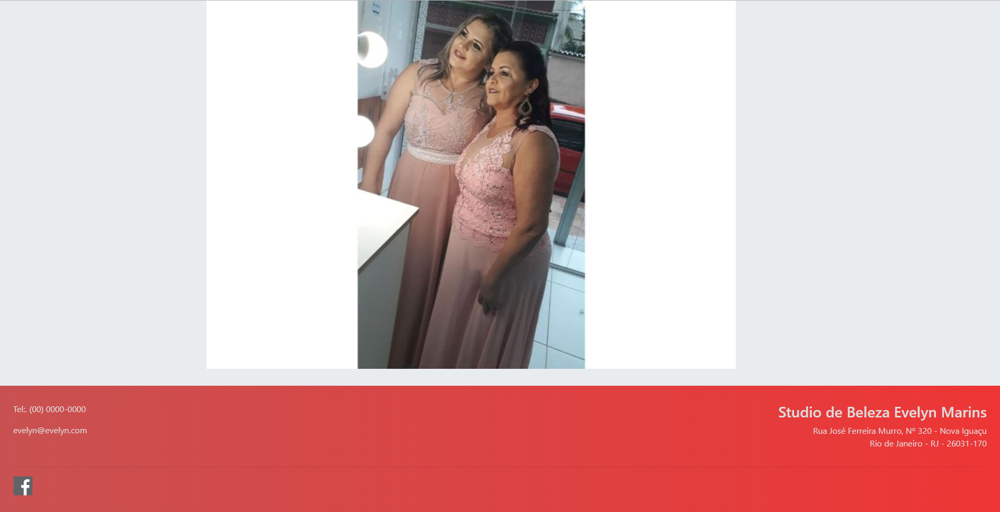
 Ao lado da página inicial, há a página de serviços que leva o usuário para a página de agendamentos. 
    
   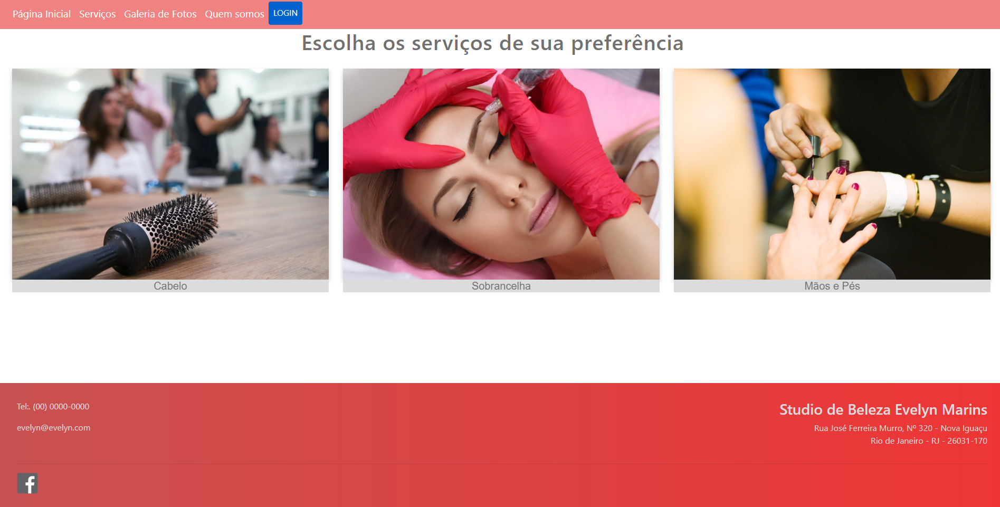

   Assim que o usuário mover o mouse por cima das imagens, aparecerá, instantaneamente, os serviços disponíveis e seus respectivos preços. Acima dos serviços há a opção agendar.

   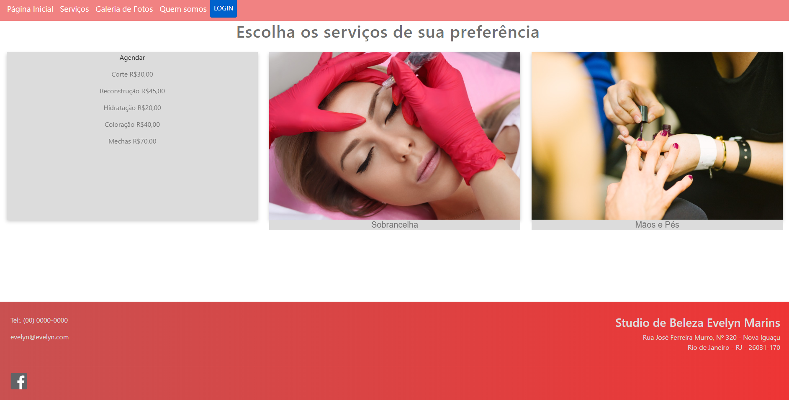
   
   Na página agendamento o usuário selecionará o serviço desejado, o profissional, a data e o horário da realização do procedimento. Vale reforçar que o cliente só poderá agendar um procedimento se for cadastrado no site! Por isso, também é possível cadastrar-se através da página de agendamento.

   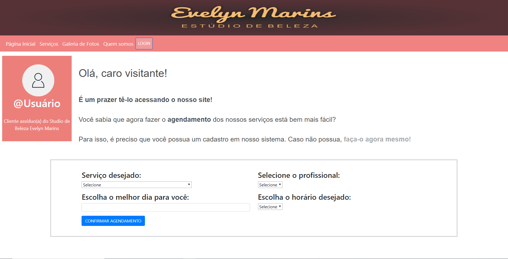

   Ao lado da página serviços encontramos a galeria de fotos, que contém fotos de diversos tipos. Nessa página o usuário encontra imagens que demonstram procedimentos realizados pelo studio.

   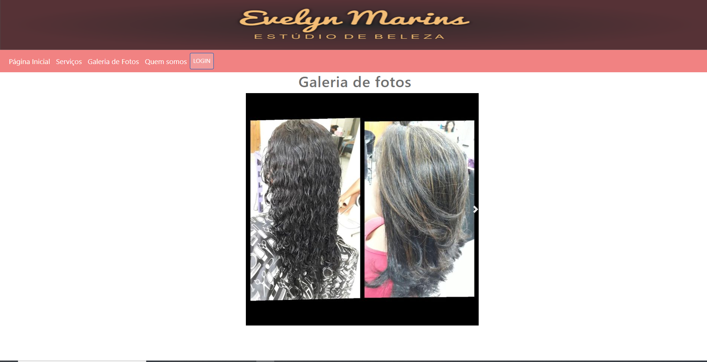 

   Ao lado da galeria de fotos econtramos a página "quem somos", que conta a história e objetivo do Studio. 
          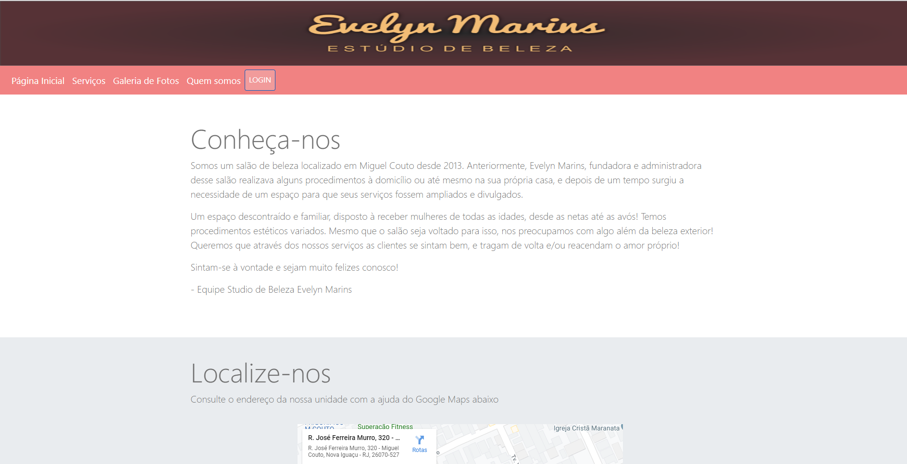
  
  No corpo da página encontramos também uma funcionalidade do Google Maps, onde o usuário pode consultar a localização do studio no mapa. 
      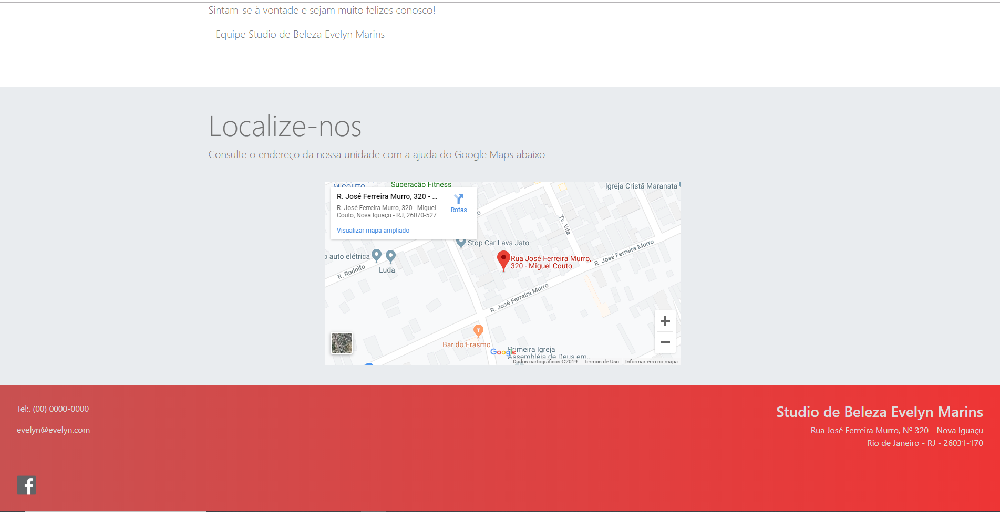
