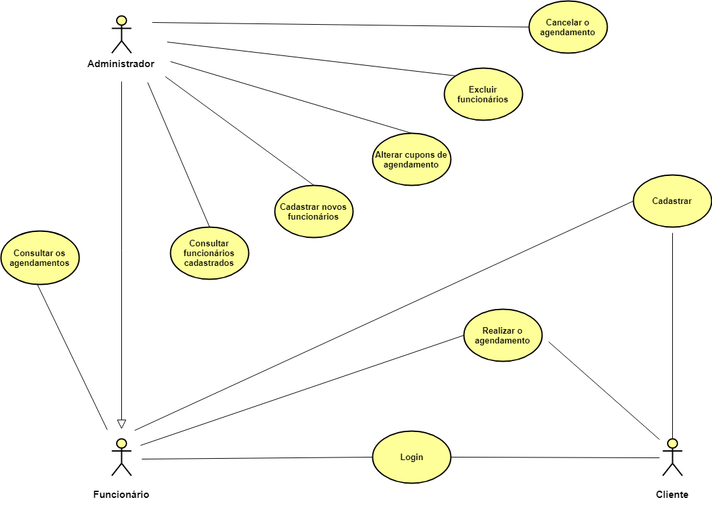
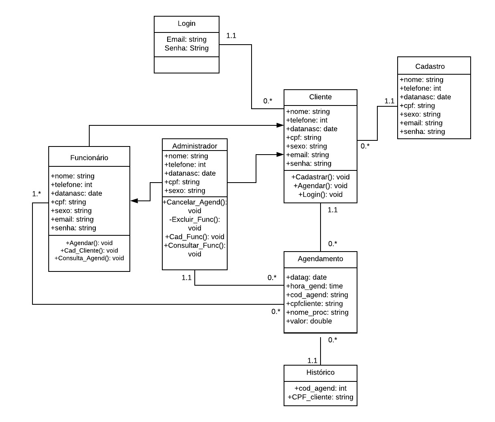

# PROJETO: SB - Studio de Beleza
## Projeto Final do Curso Técnico em Informática do Colégio Pedro II - Campus Duque de Caxias - 2019

# Integrantes:
- Emanuelle de Araújo Siqueira
- Emerson Marcelo da Silva Teixeira
- Leticia Lopes Corrêa
- Sarah Ferreira Oliveira

# Sumário
- [Proposta](#Visão-Geral-da-Proposta)
- [Requisitos](#Requisitos)
- [Casos de Uso](#Casos-de-Uso)
- [Modelagem](#Modelagem)
- [Manual de Utilização](#Manual-de-Utilização)

## Visão Geral da Proposta
- Construção de Desenvolvimento Web para um Studio de Beleza que auxilie principalmente no agendamento dos serviços oferecidos pelo salão.

[Proposta](https://github.com/cp2-dc-info-projeto-final/sb-studio-de-beleza/blob/master/proposta.md)

## Stackholder
 Evelyn Cantarino Marins Pereira - Empresária do Studio de Beleza Evelyn Marins

## Requisitos
[Entrevista em texto](https://github.com/cp2-dc-info-projeto-final/sb-studio-de-beleza/blob/master/entrevista.md)

[Entrevista em áudio](https://github.com/cp2-dc-info-projeto-final/sb-studio-de-beleza/blob/master/entrevista.mp3)

[Especificação de Requisitos](https://github.com/cp2-dc-info-projeto-final/sb-studio-de-beleza/blob/master/requisitos.md)

## Casos de Uso
Diagrama de Casos de Uso:

[Especificação de Casos de Uso](https://github.com/cp2-dc-info-projeto-final/sb-studio-de-beleza/blob/master/casos-de-uso.md)

## Modelagem

## Manual de Utilização
*Em andamento*
